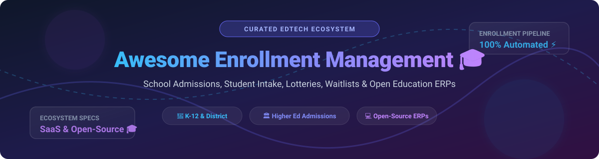

# Awesome Enrollment Management 🎓

<a href="https://github.com/ishandutta2007/Awesome-Awesome-Awesome"></a><a href="https://discord.gg/jc4xtF58Ve"></a> <a href="https://github.com/ishandutta2007"></a>



### 🚀 Top Enrollment Management Platforms Ecosystem & EdTech Software
**Curated List of SaaS Products & Open-Source GitHub Projects for School Admissions & Student Enrollment**  
*Focused on K-12 Districts, Independent Schools, Higher Education Admissions, Student Intake, Seat Lotteries, Waitlists & Online Registration*  
📅 **Last updated: September 2026**

---

## 📌 Overview & SEO Summary

This repository tracks top-tier **SaaS platforms** and **open-source projects** for **Enrollment Management** across global education sectors. These EdTech systems enable educational institutions to streamline inquiries, manage applicant pipelines, run fair lottery seat assignments, automate document collection, execute digital contracts, and facilitate student onboarding.

Whether you are an IT director choosing enterprise admissions software or a school administrator deploying self-hosted open-source education ERPs, this guide provides a structured breakdown of commercial market leaders and community-driven solutions.

---

## 📑 Table of Contents
- [📊 Market Overview & Industry Dynamics](#-market-overview--industry-dynamics)
- [💼 SaaS & Commercial Hosted Platforms](#-saas--commercial-hosted-platforms)
- [💻 Open-Source GitHub Projects](#-open-source-github-projects)
- [🛠️ Architecture & Custom Implementation Playbook](#%EF%B8%8F-architecture--custom-implementation-playbook)
- [🤝 How to Contribute](#-how-to-contribute)
- [💖 Support & Sponsorship](#-support--sponsorship)
- [📈 Star History](#-star-history)
- [⚠️ Disclaimer](#%EF%B8%8F-disclaimer)

---

## 📊 Market Overview & Industry Dynamics

The global **Enrollment Management & Admissions Software Market** is estimated at **$2.5 Billion** and is projected to reach **$4.8 Billion by 2030** (CAGR ~9.8%). 

The sector exhibits **moderate fragmentation**: while enterprise giants like PowerSchool and Blackbaud hold substantial market share through broad Student Information System (SIS) ecosystems, specialised vertical players (such as SchoolMint for district lotteries and OpenApply for international schools) maintain dominant strongholds in their specific niches.

---

## 💼 SaaS & Commercial Hosted Platforms

> [!NOTE]
> Below SaaS platforms are sorted in descending order by estimated company valuation / annual revenue scale.

| Platform / Product | Scale / Valuation | Starting Pricing | Free Tier / Trial Limits | Key Capabilities & Target Audience |
| :--- | :--- | :--- | :--- | :--- |
| **[PowerSchool Enrollment](https://www.powerschool.com/)** 🏫 | **~$5.6B** Valuation (Acquired by Bain Capital) | **$5,000 / year** (Base district tier) | **14-day administrative sandbox demo** (No permanent free plan) | District-scale online enrollment, registration, and SIS integration for K-12. |
| **[Blackbaud Enrollment](https://www.blackbaud.com/)** 🏛️ | **~$4.1B** Market Cap (NASDAQ: BLKB) | **$4,800 / year** (Core admissions module) | **14-day guided trial for accredited institutions** (No permanent free plan) | Admissions, financial aid, and tuition management for independent K-12 & higher ed. |
| **[Veracross Enrollment](https://www.veracross.com/)** 🎒 | **~$1.2B** Valuation | **$3,600 / year** (Integrated SIS package) | **30-day interactive sandbox demo** (No permanent free plan) | End-to-end admissions-to-enrollment workflows for private and independent schools. |
| **[SchoolMint](https://www.schoolmint.com/)** 🎲 | **~$150M** Revenue / Valuation | **$3,000 / year** (Per school building) | **14-day trial / interactive sandbox** (No permanent free plan) | K-12 school-choice platform, lottery engine, waitlist management, and registration. |
| **[Finalsite Enrollment](https://www.finalsite.com/)** (formerly SchoolAdmin) 🌐 | **~$120M** Revenue / Valuation | **$2,500 / year** (Starting tier) | **14-day product sandbox trial** (No permanent free plan) | Admissions CRM, online forms, automated parent communications, and enrollment. |
| **[OpenApply](https://www.openapply.com/)** 🌍 | **~$45M** Revenue | **$1,800 / year** (Up to 250 applicants) | **30-day full feature trial** (No permanent free plan) | Admissions and enrollment CRM specialized for international and independent schools. |
| **[Classe365](https://www.classe365.com/)** ☁️ | **~$12M** Revenue | **$50 / month** ($600/yr for up to 100 students) | **14-day free trial** (Full access, no credit card required) | Unified cloud SIS, CRM, LMS, and enrollment portal for academies and colleges. |
| **[OpenEduCat Hosted](https://www.openeducat.org/)** 🚀 | **~$5M** Revenue | **$19 / user / month** (Grid Cloud Plan) | **15-day free trial** (Hosted cloud instance) | Cloud-hosted edition of OpenEduCat ERP with admission, fees, and portal modules. |
| **[Fedena Enterprise](https://www.fedena.com/)** 🎓 | **~$3M** Revenue | **$360 / year** (Pro plan up to 250 students) | **14-day free trial** (Enterprise features demo) | Managed school administration platform with inquiry, applicant, and intake modules. |

---

## 💻 Open-Source GitHub Projects

> [!TIP]
> Open-source options provide self-hosted control and data privacy. Repositories below are sorted in descending order by GitHub Stars_Counts. Click Stars_Badges to view stargazers.

- **[ERPNext Education Module](https://github.com/frappe/erpnext)** [](https://github.com/frappe/erpnext/stargazers)  
  *Comprehensive open-source ERP (Python/Frappe framework) with complete education domain modules for student admission, fee collection, course enrollment, and student portals.*

- **[FeathersJS Form & Intake Engines](https://github.com/feathersjs/feathers)** [](https://github.com/feathersjs/feathers/stargazers)  
  *Real-time microservice framework used for building custom application intake pipelines, form APIs, document collection services, and real-time waitlists.*

- **[OpenEduCat ERP](https://github.com/openeducat/openeducat_erp)** [](https://github.com/openeducat/openeducat_erp/stargazers)  
  *Open-source Educational ERP (LGPL, built on Odoo) featuring admission management, student enrollment pipelines, academic structures, LMS, and 70+ school management modules.*

- **[RosarioSIS](https://github.com/francoisjacquet/rosariosis)** [](https://github.com/francoisjacquet/rosariosis/stargazers)  
  *Free & open-source Student Information System (PHP/PostgreSQL) with built-in student registration, demographic tracking, admissions management, and parent portal.*

- **[Gibbon Edu](https://github.com/gibbonedu/core)** [](https://github.com/gibbonedu/core/stargazers)  
  *Flexible open-source school platform tailored for teachers and administrators, including application forms, student records, and enrollment intake tools.*

- **[Project Fedena](https://github.com/projectfedena/fedena)** [](https://github.com/projectfedena/fedena/stargazers)  
  *Open-source school management system (Ruby on Rails, Apache 2.0) with admission workflows, student records, fee intake, and campus administration.*

- **[openSIS Classic](https://github.com/OS4ED/openSIS-Classic)** [](https://github.com/OS4ED/openSIS-Classic/stargazers)  
  *Commercial-grade open-source SIS providing web-based student registration, enrollment processing, transcripts, and parent/student portals.*

---

## 🛠️ Architecture & Custom Implementation Playbook

```
[ Prospective Family ] ➔ [ Custom / Open Form Portal ] ➔ [ Automated Screening & Waitlist ]
                                                                     │
                                                                     ▼
[ Enrolled Student Record ] ◄── [ Fee Intake & Registration ] ◄── [ Seat Assignment / Lottery ]
```

### Self-Hosted Implementation Options
1. **Full Educational ERP Deployment**: Deploy **OpenEduCat** or **ERPNext** to get integrated admissions, fee schedules, and student records out of the box.
2. **Specialized SIS Intake**: Deploy **RosarioSIS** or **Gibbon** for lightweight student registration and document collection.
3. **Custom Choice Lotteries**: Combine self-hosted application forms with custom Python/R scripts for random seat allocations and district waitlists.

---

## 🤝 How to Contribute

Contributions are welcome! To add or update platforms and repositories:
1. Fork this repository.
2. Update `README.md` following the tabular format for SaaS or Stars_Badge format for Open Source.
3. Ensure pricing, valuation, and GitHub repository links are accurate and verified.
4. Submit a Pull Request with a short explanation.

---

## 💖 Support & Sponsorship

If you find this repository helpful for your school, district, or EdTech research:
- ⭐ **Star** this repository to stay updated.
- 🔀 **Fork** it to customize for your institution.
- 📢 **Share** with school administrators, admissions teams, and EdTech developers.
- ☕ **Buy me a coffee**: Support ongoing open-source curation via the [GitHub Sponsor Dashboard](https://github.com/sponsors/ishandutta2007).

---

## 📈 Star History

[](https://star-history.dera.page/#ishandutta2007/Awesome-Enrollment-Management&type=date&legend=top-left)

---

## ⚠️ Disclaimer

- This is a **community-curated list** — it is not exhaustive and does not constitute an endorsement.
- Enrollment management systems handle sensitive student and family personally identifiable information (PII) subject to data privacy legislation (e.g., FERPA, GDPR, COPPA). Open-source deployments require proper security hardening, access controls, and compliance audits.

---
**Made with ❤️ for school administrators, admissions teams, and open-source EdTech advocates.**
